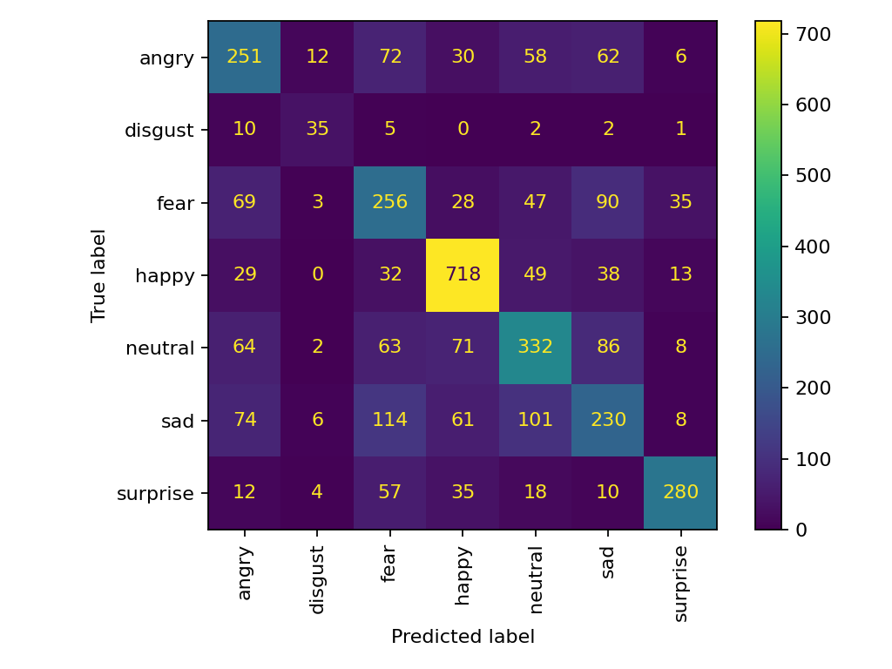

# Vision FER-2013 Emotions (CNN + Transfer Learning)

**What it is**: Train an emotion classifier on FER-2013 (or similar) with strong baselines,
augmentations, and explainability (Grad-CAM).

**Tech stack**: Python 3.11, PyTorch, TorchVision, Albumentations, scikit-learn, pytest

## Why this project stands out
- Clear baselines: small CNN vs. transfer learning (ResNet18)
- Reproducible: fixed seeds, stratified splits, test-only once
- Explainability: Grad-CAM heatmaps for sample images

## How you'd build it (logic in brief)
1. **Data** → load CSV/images, create stratified train/val/test splits by label.
2. **Augment** → train-time augmentations (flip, crop, brightness) with validation kept clean.
3. **Models** → start with a tiny CNN, then fine-tune ResNet18; compare metrics.
4. **Eval** → report accuracy/F1, confusion matrix; save misclassified examples.
5. **Explain** → Grad-CAM on correctly/incorrectly classified images.

## Setup
```bash
python -m venv .venv && source .venv/bin/activate
pip install -r requirements.txt
pytest -q
```

## Repo structure
```
vision-fer2013-emotions/
  ├─ src/
  │   ├─ data.py
  │   ├─ models.py
  │   ├─ train.py
  │   ├─ evaluate.py
  │   └─ explain.py
  ├─ tests/
  │   └─ test_smoke.py
  ├─ data/
  │   └─ sample/  # tiny sample to verify the pipeline
  ├─ models/
  ├─ artifacts/
  ├─ requirements.txt
  ├─ ROADMAP.md
  ├─ REPORT.md
  ├─ LICENSE
  └─ .gitignore

```
### Results

**Confusion Matrix (Test Set)**  


**Grad-CAM Visualizations**  
<p float="left">
  
  
  
  
</p>